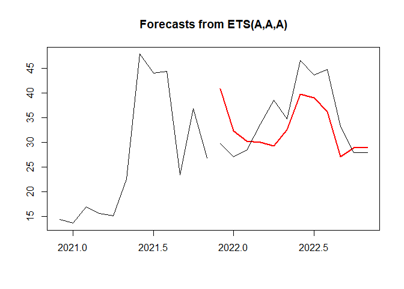
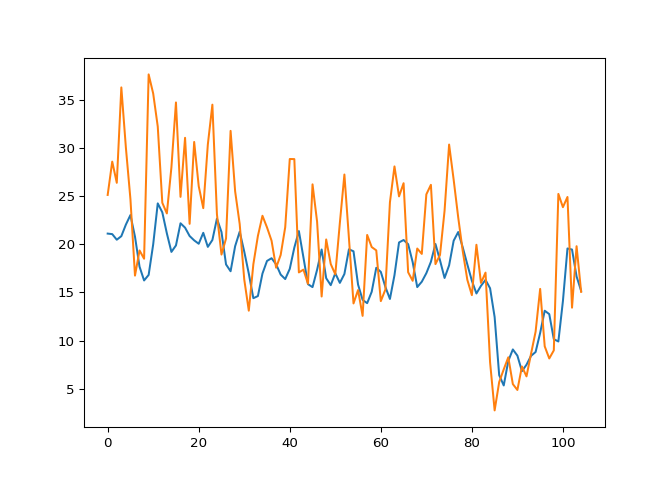
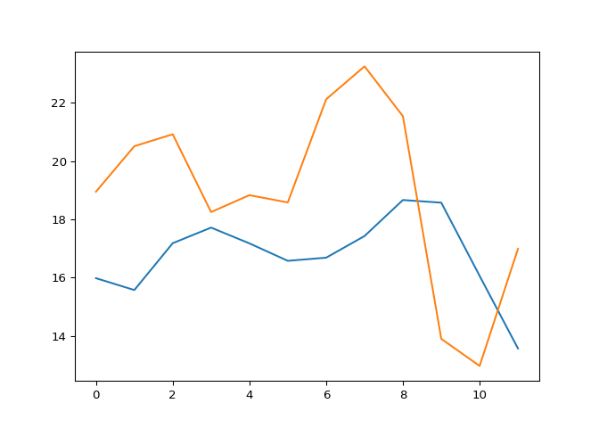

## Chicago Airport Performance Predictions

Contributors: Eva Nikolai, Patrick Armstrong, Carson Hayes-Singer, Yixin
Li

To acquire the data, we scraped the Bureau of Transportation Statistics
website. The site has both yearly and monthly data available on multiple
metrics related to flight departures, delays, and cancellations. For our
project we wanted to get all the monthly departure data available from
2013-2022 for both Chicago O’Hare and Chicago Midway. Specifically, we
wanted to look at the “Departure Delayed %” column of the data tables.
\* This data is saved in “O’Hare\_cleaned.csv” and “midway\_cleaned.csv”

Read in the data. Explored the data to make sure it was consistent and
accurate. Dropped unnecessary columns from the data sets.

    Ohare <- read.csv("O'Hare_cleaned.csv")
    dim(Ohare)

    ## [1] 119   4

    head(Ohare)

    ##   X year Month Delayed....
    ## 1 0 2013     1       26.05
    ## 2 1 2013     2       30.89
    ## 3 2 2013     3       25.11
    ## 4 3 2013     4       28.57
    ## 5 4 2013     5       26.37
    ## 6 5 2013     6       36.27

    tail(Ohare)

    ##       X year Month Delayed....
    ## 114 131 2022     6       22.12
    ## 115 132 2022     7       23.25
    ## 116 133 2022     8       21.54
    ## 117 134 2022     9       13.90
    ## 118 135 2022    10       12.97
    ## 119 136 2022    11       16.99

    Ohare <- Ohare[, -1]

    Midway <- read.csv("midway_cleaned.csv")
    dim(Midway)

    ## [1] 119   4

    head(Midway)

    ##   X year Month Delayed....
    ## 1 0 2013     1       25.98
    ## 2 1 2013     2       23.41
    ## 3 2 2013     3       27.95
    ## 4 3 2013     4       26.31
    ## 5 4 2013     5       29.36
    ## 6 5 2013     6       40.22

    tail(Midway)

    ##       X year Month Delayed....
    ## 114 131 2022     6       46.59
    ## 115 132 2022     7       43.68
    ## 116 133 2022     8       44.79
    ## 117 134 2022     9       33.14
    ## 118 135 2022    10       27.95
    ## 119 136 2022    11       27.98

    Midway <- Midway[,-1]

## Data Exploration:

    #Ohare time plot of the differenced series for the delayed monthly departure percentage 
    plot.ts(diff(Ohare$Delayed....))

    #Midway time plot of the differenced series for the delayed monthly departure percentage 
    plot.ts(diff(Midway$Delayed....))

## Create Time Series:

    Ohare.ts <- ts(Ohare$Delayed...., start = c(2013,1), end = c(2022,11), frequency = 12)
    Midway.ts <- ts(Midway$Delayed...., start = c(2013,1), end = c(2022,11), frequency = 12)

## Plot the Time Series:

    plot(Ohare.ts, main = "O'Hare vs Midway", ylim = c(0,60), xlab = "", ylab = "")
    lines(Midway.ts, col = "red")
    legend("bottomleft", legend = c("O'Hare", "Midway"), col = c("black", "red"), lty = 1)

## Data Partitioning:

    nValid <- 12
    nTrain <- length(Ohare.ts) - nValid
    train.Ohare<- window(Ohare.ts, start = c(2013,1), end = c(2013,nTrain))
    valid.Ohare <- window(Ohare.ts, start=c(2013, nTrain+1), end = c(2013, nTrain+nValid))
    valid.Ohare

    ##        Jan   Feb   Mar   Apr   May   Jun   Jul   Aug   Sep   Oct   Nov   Dec
    ## 2021                                                                   18.95
    ## 2022 20.51 20.92 18.25 18.83 18.58 22.12 23.25 21.54 13.90 12.97 16.99

    nValid <- 12
    nTrain <- length(Midway.ts) - nValid
    train.Midway <- window(Midway.ts, start = c(2013,1), end = c(2013,nTrain))
    valid.Midway <- window(Midway.ts, start=c(2013, nTrain+1), end = c(2013, nTrain+nValid))
    valid.Midway

    ##        Jan   Feb   Mar   Apr   May   Jun   Jul   Aug   Sep   Oct   Nov   Dec
    ## 2021                                                                   29.82
    ## 2022 27.08 28.44 33.83 38.54 34.76 46.59 43.68 44.79 33.14 27.95 27.98

## Check for Random Walk:

**Indications of a random walk:** **1) Auto correlations of the
differenced series are close to zero.** **2) The coefficient of AR1
component is close to 1.**

    library(forecast)

    ## Warning: package 'forecast' was built under R version 4.2.2

    ## Registered S3 method overwritten by 'quantmod':
    ##   method            from
    ##   as.zoo.data.frame zoo

    library(zoo)

    ## 
    ## Attaching package: 'zoo'

    ## The following objects are masked from 'package:base':
    ## 
    ##     as.Date, as.Date.numeric

    # Ohare check
    Acf(Ohare.ts)

    Acf(diff(Ohare.ts))  

    # Midway check
    Acf(Midway.ts)

    Acf(diff(Midway.ts))  

Based on these plots, it appears that both the delayed departure
percentages for Chicago O’Hare & Midway are not random walks.

    fit_Ohare <-Arima(Ohare$Delayed...., order=c(1,0,0))
    summary(fit_Ohare)  # ( 0.7088 - 1 ) / 0.0637 = -4.571429

    ## Series: Ohare$Delayed.... 
    ## ARIMA(1,0,0) with non-zero mean 
    ## 
    ## Coefficients:
    ##          ar1     mean
    ##       0.7088  20.3693
    ## s.e.  0.0637   1.5633
    ## 
    ## sigma^2 = 26.11:  log likelihood = -362.3
    ## AIC=730.6   AICc=730.81   BIC=738.94
    ## 
    ## Training set error measures:
    ##                       ME     RMSE      MAE       MPE     MAPE      MASE
    ## Training set -0.04789779 5.066683 3.940038 -10.40266 24.82965 0.9178074
    ##                    ACF1
    ## Training set 0.01016725

    fit_Midway <-Arima(Midway$Delayed...., order=c(1,0,0))
    summary(fit_Midway)  # ( 0.7482 - 1 ) /  0.0593 = -4.246206

    ## Series: Midway$Delayed.... 
    ## ARIMA(1,0,0) with non-zero mean 
    ## 
    ## Coefficients:
    ##          ar1     mean
    ##       0.7482  25.3466
    ## s.e.  0.0593   2.3456
    ## 
    ## sigma^2 = 44.32:  log likelihood = -393.85
    ## AIC=793.7   AICc=793.91   BIC=802.04
    ## 
    ## Training set error measures:
    ##                        ME     RMSE      MAE       MPE     MAPE      MASE
    ## Training set -0.005557173 6.601492 4.896408 -12.81221 27.51342 0.9568048
    ##                     ACF1
    ## Training set -0.03437381

Looking at the AR1 and standard errors for both O’Hare and Midway, we
are able to validate the data was not a random walk.

## Regression-based model(s)

First, lets evaluate all regression based models on the Chicago O’Hare
delayed departure percentage dataset.

**Ohare**

    linear_mod_Ohare <- tslm(train.Ohare ~ trend)
    summary(linear_mod_Ohare)

    ## 
    ## Call:
    ## tslm(formula = train.Ohare ~ trend)
    ## 
    ## Residuals:
    ##      Min       1Q   Median       3Q      Max 
    ## -12.5849  -4.3598  -0.4457   5.0523  13.4913 
    ## 
    ## Coefficients:
    ##             Estimate Std. Error t value Pr(>|t|)    
    ## (Intercept) 28.65569    1.15983  24.707  < 2e-16 ***
    ## trend       -0.15137    0.01864  -8.119 9.59e-13 ***
    ## ---
    ## Signif. codes:  0 '***' 0.001 '**' 0.01 '*' 0.05 '.' 0.1 ' ' 1
    ## 
    ## Residual standard error: 5.957 on 105 degrees of freedom
    ## Multiple R-squared:  0.3857, Adjusted R-squared:  0.3798 
    ## F-statistic: 65.92 on 1 and 105 DF,  p-value: 9.588e-13

    head(linear_mod_Ohare$fitted.values, 12)

    ##           Jan      Feb      Mar      Apr      May      Jun      Jul      Aug
    ## 2013 28.50431 28.35294 28.20157 28.05020 27.89883 27.74745 27.59608 27.44471
    ##           Sep      Oct      Nov      Dec
    ## 2013 27.29334 27.14196 26.99059 26.83922

    linear_season_Ohare <- tslm(train.Ohare ~ trend + season)
    summary(linear_season_Ohare)

    ## 
    ## Call:
    ## tslm(formula = train.Ohare ~ trend + season)
    ## 
    ## Residuals:
    ##      Min       1Q   Median       3Q      Max 
    ## -14.0174  -2.8461  -0.2681   3.3805   9.6628 
    ## 
    ## Coefficients:
    ##             Estimate Std. Error t value Pr(>|t|)    
    ## (Intercept) 30.50453    1.89388  16.107  < 2e-16 ***
    ## trend       -0.14844    0.01622  -9.151 1.17e-14 ***
    ## season2      0.45288    2.43113   0.186  0.85262    
    ## season3     -4.87646    2.43130  -2.006  0.04776 *  
    ## season4     -5.98136    2.43157  -2.460  0.01573 *  
    ## season5     -3.39847    2.43195  -1.397  0.16557    
    ## season6      3.88219    2.43243   1.596  0.11384    
    ## season7      2.12951    2.43303   0.875  0.38367    
    ## season8      0.77684    2.43373   0.319  0.75029    
    ## season9     -6.40584    2.43454  -2.631  0.00994 ** 
    ## season10    -4.64295    2.43546  -1.906  0.05965 .  
    ## season11    -5.47229    2.43649  -2.246  0.02705 *  
    ## season12    -0.37018    2.50721  -0.148  0.88294    
    ## ---
    ## Signif. codes:  0 '***' 0.001 '**' 0.01 '*' 0.05 '.' 0.1 ' ' 1
    ## 
    ## Residual standard error: 5.157 on 94 degrees of freedom
    ## Multiple R-squared:  0.5878, Adjusted R-squared:  0.5351 
    ## F-statistic: 11.17 on 12 and 94 DF,  p-value: 1.602e-13

    head(linear_season_Ohare$fitted.values, 12)

    ##           Jan      Feb      Mar      Apr      May      Jun      Jul      Aug
    ## 2013 30.35610 30.66054 25.18276 23.92943 26.36387 33.49610 31.59499 30.09387
    ##           Sep      Oct      Nov      Dec
    ## 2013 22.76276 24.37721 23.39943 28.35311

    linear_mod_Ohare_pred <- forecast(linear_mod_Ohare, h=nValid, level = 0)
    linear_season_Ohare_pred <- forecast(linear_season_Ohare, h=nValid)
    plot(linear_mod_Ohare_pred, include = 12)
    lines(linear_season_Ohare_pred$mean, col = 'green', lwd = 2)
    lines(valid.Ohare)
    legend("topleft", legend = c("Actual", "Seasonal", "Linear"),
           col = c("black", "green", "blue"), lty = c(1, 1, 1), lwd = c(1, 2, 1),  cex = 0.7)

From this forecast, we see that seasonal linear regression model
performs better when taking into consideration trend and seasonality as
opposed to the linear regression model that only considers trend.
Therefore, we should drop linear\_mod\_Ohare and continue evaluating
other regression based models in comparison to linear\_season\_Ohare.

**We now consider poly\_season\_Ohare that captures seasonality and
polynomial trend**

    options(scipen = 999)
    poly_season_Ohare <- tslm(train.Ohare ~ trend + I(trend^2)+ season)
    summary(poly_season_Ohare)

    ## 
    ## Call:
    ## tslm(formula = train.Ohare ~ trend + I(trend^2) + season)
    ## 
    ## Residuals:
    ##      Min       1Q   Median       3Q      Max 
    ## -14.0847  -2.8076  -0.2825   3.4070   9.3164 
    ## 
    ## Coefficients:
    ##               Estimate Std. Error t value            Pr(>|t|)    
    ## (Intercept) 30.8915727  2.2162845  13.938 <0.0000000000000002 ***
    ## trend       -0.1700841  0.0656072  -2.592              0.0111 *  
    ## I(trend^2)   0.0002004  0.0005884   0.341              0.7342    
    ## season2      0.4546856  2.4426529   0.186              0.8527    
    ## season3     -4.8732520  2.4428284  -1.995              0.0490 *  
    ## season4     -5.9771459  2.4431133  -2.447              0.0163 *  
    ## season5     -3.3936630  2.4435033  -1.389              0.1682    
    ## season6      3.8871969  2.4439959   1.591              0.1151    
    ## season7      2.1343225  2.4445900   0.873              0.3849    
    ## season8      0.7810473  2.4452866   0.319              0.7501    
    ## season9     -6.4026288  2.4460879  -2.617              0.0103 *  
    ## season10    -4.6411502  2.4469983  -1.897              0.0610 .  
    ## season11    -5.4722946  2.4480235  -2.235              0.0278 *  
    ## season12    -0.3242756  2.5226868  -0.129              0.8980    
    ## ---
    ## Signif. codes:  0 '***' 0.001 '**' 0.01 '*' 0.05 '.' 0.1 ' ' 1
    ## 
    ## Residual standard error: 5.182 on 93 degrees of freedom
    ## Multiple R-squared:  0.5883, Adjusted R-squared:  0.5307 
    ## F-statistic: 10.22 on 13 and 93 DF,  p-value: 0.0000000000005243

**Let’s look at the forecasts generated by poly\_season\_Ohare in
comparison to the benchmark naive**

    poly_season_Ohare_pred <- forecast(poly_season_Ohare, h= nValid, level = 0)
    snaive_Ohare_pred <- snaive(train.Ohare, h=nValid, level = 0)

    plot(poly_season_Ohare_pred, include = 12)
    lines(linear_season_Ohare_pred$mean, col = 'red', lwd = 2)
    lines(snaive_Ohare_pred$mean, col = 'green', lwd = 2)
    lines(valid.Ohare)
    legend("topleft", legend = c("Actual", "Seasonal", "Naive", "Poly"),
           col = c("black", "red", "green", "blue"), lty = c(1, 1, 1), lwd = c(1, 2, 1),  cex = 0.7)

From this forecast, it appears that after the Naive method, the
polynomial seasonal regression model performs better than the linear
seasonal regression model.

Next, let’s evaluate whether the exponential seasonal regression model
can outperform the polynomial seasonal regression model.

    exp_season_Ohare <- tslm(train.Ohare ~ trend + season, lambda = 0) 
    summary(exp_season_Ohare)

    ## 
    ## Call:
    ## tslm(formula = train.Ohare ~ trend + season, lambda = 0)
    ## 
    ## Residuals:
    ##      Min       1Q   Median       3Q      Max 
    ## -1.32711 -0.13675  0.04377  0.20951  0.62959 
    ## 
    ## Coefficients:
    ##              Estimate Std. Error t value             Pr(>|t|)    
    ## (Intercept)  3.535574   0.131328  26.922 < 0.0000000000000002 ***
    ## trend       -0.008995   0.001125  -7.997     0.00000000000324 ***
    ## season2      0.024882   0.168583   0.148               0.8830    
    ## season3     -0.253949   0.168595  -1.506               0.1354    
    ## season4     -0.405342   0.168613  -2.404               0.0182 *  
    ## season5     -0.206315   0.168640  -1.223               0.2242    
    ## season6      0.138857   0.168673   0.823               0.4125    
    ## season7      0.104177   0.168715   0.617               0.5384    
    ## season8      0.016483   0.168763   0.098               0.9224    
    ## season9     -0.339699   0.168820  -2.012               0.0471 *  
    ## season10    -0.226565   0.168883  -1.342               0.1830    
    ## season11    -0.275066   0.168954  -1.628               0.1069    
    ## season12    -0.020722   0.173859  -0.119               0.9054    
    ## ---
    ## Signif. codes:  0 '***' 0.001 '**' 0.01 '*' 0.05 '.' 0.1 ' ' 1
    ## 
    ## Residual standard error: 0.3576 on 94 degrees of freedom
    ## Multiple R-squared:  0.4961, Adjusted R-squared:  0.4317 
    ## F-statistic: 7.711 on 12 and 94 DF,  p-value: 0.0000000008948

    exp_season_Ohare_pred <- forecast(exp_season_Ohare, h= nValid, level=0)
    plot(exp_season_Ohare_pred, include = 12)
    lines(poly_season_Ohare_pred$mean, col = 'red')
    lines(snaive_Ohare_pred$mean, col = 'green')
    lines(valid.Ohare)
    legend("topleft", legend = c("Actual", "Poly", "Naive", "Exp"),
           col = c("black", "red", "green", "blue"), lty = c(1, 1, 1), lwd = c(1, 2, 1),  cex = 0.7)

From this plot, we can assume that the polynomial seasonal regression
model performs best on the Chicago O’Hare data.

To prove this, lets compare all regression based models accuracy to the
benchmark seasonal naive method.

**Compute RMSE, MAE, MAPE using accuracy() to find best **

    accuracy(linear_season_Ohare_pred$mean, valid.Ohare)  

    ##                ME    RMSE      MAE      MPE     MAPE       ACF1 Theil's U
    ## Test set 7.236099 7.49239 7.236099 39.23123 39.23123 0.05804819  2.601785

    accuracy(poly_season_Ohare_pred$mean, valid.Ohare)   # Best Performing Regression-based Model

    ##               ME     RMSE     MAE      MPE     MAPE       ACF1 Theil's U
    ## Test set 6.71497 6.988869 6.71497 36.35239 36.35239 0.06495534  2.425748

    accuracy(exp_season_Ohare_pred$mean, valid.Ohare)

    ##                ME     RMSE      MAE     MPE    MAPE      ACF1 Theil's U
    ## Test set 7.747465 7.963419 7.747465 40.7447 40.7447 0.3168323  2.634914

    accuracy(snaive_Ohare_pred$mean, valid.Ohare)  

    ##              ME     RMSE      MAE      MPE     MAPE      ACF1 Theil's U
    ## Test set 3.5975 6.987528 5.909167 17.91139 32.03371 0.5351047   2.19638

Now, lets evaluate all regression based models on Chicago Midway’s
delayed departure percentage dataset.

**Midway**

    linear_mod_Midway <- tslm(train.Midway ~ trend)
    summary(linear_mod_Midway)

    ## 
    ## Call:
    ## tslm(formula = train.Midway ~ trend)
    ## 
    ## Residuals:
    ##     Min      1Q  Median      3Q     Max 
    ## -18.807  -6.094  -1.152   5.697  29.393 
    ## 
    ## Coefficients:
    ##             Estimate Std. Error t value             Pr(>|t|)    
    ## (Intercept) 29.62066    1.82750  16.208 < 0.0000000000000002 ***
    ## trend       -0.10027    0.02938  -3.413             0.000913 ***
    ## ---
    ## Signif. codes:  0 '***' 0.001 '**' 0.01 '*' 0.05 '.' 0.1 ' ' 1
    ## 
    ## Residual standard error: 9.386 on 105 degrees of freedom
    ## Multiple R-squared:  0.09988,    Adjusted R-squared:  0.0913 
    ## F-statistic: 11.65 on 1 and 105 DF,  p-value: 0.0009129

    head(linear_mod_Midway$fitted.values, 12)

    ##           Jan      Feb      Mar      Apr      May      Jun      Jul      Aug
    ## 2013 29.52038 29.42011 29.31984 29.21957 29.11930 29.01903 28.91875 28.81848
    ##           Sep      Oct      Nov      Dec
    ## 2013 28.71821 28.61794 28.51767 28.41739

    linear_season_Midway <- tslm(train.Midway ~ trend + season)
    summary(linear_season_Midway)

    ## 
    ## Call:
    ## tslm(formula = train.Midway ~ trend + season)
    ## 
    ## Residuals:
    ##      Min       1Q   Median       3Q      Max 
    ## -19.9415  -4.6177  -0.5525   4.2906  23.2770 
    ## 
    ## Coefficients:
    ##             Estimate Std. Error t value           Pr(>|t|)    
    ## (Intercept) 28.14311    3.17148   8.874 0.0000000000000456 ***
    ## trend       -0.10061    0.02716  -3.704           0.000358 ***
    ## season2     -1.50273    4.07117  -0.369           0.712873    
    ## season3     -1.73323    4.07144  -0.426           0.671297    
    ## season4     -2.56484    4.07190  -0.630           0.530295    
    ## season5      1.71688    4.07253   0.422           0.674298    
    ## season6      9.44859    4.07334   2.320           0.022527 *  
    ## season7      8.11365    4.07434   1.991           0.049339 *  
    ## season8      5.48314    4.07552   1.345           0.181737    
    ## season9     -4.05403    4.07687  -0.994           0.322583    
    ## season10    -1.66231    4.07841  -0.408           0.684504    
    ## season11    -2.21614    4.08013  -0.543           0.588309    
    ## season12     7.59721    4.19857   1.809           0.073573 .  
    ## ---
    ## Signif. codes:  0 '***' 0.001 '**' 0.01 '*' 0.05 '.' 0.1 ' ' 1
    ## 
    ## Residual standard error: 8.636 on 94 degrees of freedom
    ## Multiple R-squared:  0.3178, Adjusted R-squared:  0.2307 
    ## F-statistic: 3.648 on 12 and 94 DF,  p-value: 0.0001673

    head(linear_season_Midway$fitted.values, 12)

    ##           Jan      Feb      Mar      Apr      May      Jun      Jul      Aug
    ## 2013 28.04251 26.43917 26.10806 25.17584 29.35695 36.98806 35.55251 32.82140
    ##           Sep      Oct      Nov      Dec
    ## 2013 23.18362 25.47473 24.82028 34.53303

    linear_mod_Midway_pred <- forecast(linear_mod_Midway, h=nValid, level = 0)
    linear_season_Midway_pred <- forecast(linear_season_Midway, h=nValid)
    plot(linear_mod_Midway_pred, include = 12)
    lines(linear_season_Midway_pred$mean, col = 'green', lwd = 2)
    lines(valid.Midway)
    legend("topleft", legend = c("Actual", "Seasonal", "Linear"),
           col = c("black", "green", "blue"), lty = c(1, 1, 1), lwd = c(1, 2, 1),  cex = 0.7)

From this forecast, we see that the seasonal linear regression model
performs better when taking into consideration trend and seasonality as
opposed to the linear regression model that only considers trend.
Therefore, we should drop linear\_mod\_Midway and continue evaluating
other regression based models in comparison to linear\_season\_Midway.

**We now consider poly\_season\_Midway that capture seasonality and
polynomial trend**

    options(scipen = 999)
    poly_season_Midway <- tslm(train.Midway ~ trend + I(trend^2)+ season)
    summary(poly_season_Midway)

    ## 
    ## Call:
    ## tslm(formula = train.Midway ~ trend + I(trend^2) + season)
    ## 
    ## Residuals:
    ##      Min       1Q   Median       3Q      Max 
    ## -20.9879  -3.7416  -0.0386   5.5080  20.6917 
    ## 
    ## Coefficients:
    ##               Estimate Std. Error t value            Pr(>|t|)    
    ## (Intercept) 33.0956333  3.5760564   9.255 0.00000000000000772 ***
    ## trend       -0.3776000  0.1058596  -3.567            0.000573 ***
    ## I(trend^2)   0.0025647  0.0009495   2.701            0.008209 ** 
    ## season2     -1.4796429  3.9413102  -0.375            0.708204    
    ## season3     -1.6921930  3.9415934  -0.429            0.668686    
    ## season4     -2.5109837  3.9420531  -0.637            0.525707    
    ## season5      1.7784294  3.9426824   0.451            0.652988    
    ## season6      9.5127131  3.9434771   2.412            0.017816 *  
    ## season7      8.1752006  3.9444358   2.073            0.040977 *  
    ## season8      5.5370030  3.9455597   1.403            0.163842    
    ## season9     -4.0129907  3.9468527  -1.017            0.311907    
    ## season10    -1.6392250  3.9483216  -0.415            0.678974    
    ## season11    -2.2161443  3.9499758  -0.561            0.576111    
    ## season12     8.1845317  4.0704478   2.011            0.047251 *  
    ## ---
    ## Signif. codes:  0 '***' 0.001 '**' 0.01 '*' 0.05 '.' 0.1 ' ' 1
    ## 
    ## Residual standard error: 8.361 on 93 degrees of freedom
    ## Multiple R-squared:  0.3674, Adjusted R-squared:  0.279 
    ## F-statistic: 4.155 on 13 and 93 DF,  p-value: 0.00002112

**Let’s look at the forecasts generated by poly\_season\_Midway in
comparison to benchmark naive**

    poly_season_Midway_pred <- forecast(poly_season_Midway, h= nValid, level = 0)
    snaive_Midway_pred <- snaive(train.Midway, h=nValid, level = 0)

    plot(poly_season_Midway_pred, include = 12)
    lines(linear_season_Midway_pred$mean, col = 'red', lwd = 2)
    lines(snaive_Midway_pred$mean, col = 'green', lwd = 2)
    lines(valid.Midway)
    legend("topleft", legend = c("Actual", "Seasonal", "Naive", "Poly"),
           col = c("black", "red", "green", "blue"), lty = c(1, 1, 1), lwd = c(1, 2, 1),  cex = 0.7)

From this forecast, it appears that after the Naive method, the
polynomial seasonal regression model performs better than the linear
seasonal regression model.

Next, let’s evaluate whether the exponential seasonal regression model
can outperform the polynomial seasonal regression model.

    exp_season_Midway <- tslm(train.Midway ~ trend + season, lambda = 0) 
    summary(exp_season_Midway)

    ## 
    ## Call:
    ## tslm(formula = train.Midway ~ trend + season, lambda = 0)
    ## 
    ## Residuals:
    ##      Min       1Q   Median       3Q      Max 
    ## -1.90014 -0.17456  0.02223  0.23816  1.01211 
    ## 
    ## Coefficients:
    ##              Estimate Std. Error t value             Pr(>|t|)    
    ## (Intercept)  3.410623   0.176920  19.278 < 0.0000000000000002 ***
    ## trend       -0.006347   0.001515  -4.189            0.0000632 ***
    ## season2     -0.074892   0.227108  -0.330                0.742    
    ## season3     -0.113515   0.227124  -0.500                0.618    
    ## season4     -0.263815   0.227149  -1.161                0.248    
    ## season5     -0.010016   0.227184  -0.044                0.965    
    ## season6      0.335148   0.227230   1.475                0.144    
    ## season7      0.275234   0.227285   1.211                0.229    
    ## season8      0.176455   0.227351   0.776                0.440    
    ## season9     -0.204127   0.227427  -0.898                0.372    
    ## season10    -0.142013   0.227512  -0.624                0.534    
    ## season11    -0.121743   0.227608  -0.535                0.594    
    ## season12     0.277287   0.234215   1.184                0.239    
    ## ---
    ## Signif. codes:  0 '***' 0.001 '**' 0.01 '*' 0.05 '.' 0.1 ' ' 1
    ## 
    ## Residual standard error: 0.4818 on 94 degrees of freedom
    ## Multiple R-squared:  0.2725, Adjusted R-squared:  0.1797 
    ## F-statistic: 2.935 on 12 and 94 DF,  p-value: 0.001686

    exp_season_Midway_pred <- forecast(exp_season_Midway, h= nValid, level=0)
    plot(exp_season_Midway_pred, include = 12)
    lines(poly_season_Midway_pred$mean, col = 'red')
    lines(snaive_Midway_pred$mean, col = 'green')
    lines(valid.Midway)
    legend("topleft", legend = c("Actual", "Poly", "Naive", "Exp"),
           col = c("black", "red", "green", "blue"), lty = c(1, 1, 1), lwd = c(1, 2, 1),  cex = 0.7)

From this plot, we can assume that the polynomial seasonal regression
model performs best on the Chicago O’Hare data.

To prove this, lets compare all regression based models accuracy to the
benchmark seasonal naive method.

**Compute RMSE, MAE, MAPE using accuracy() to find best**

    accuracy(linear_season_Midway_pred$mean, valid.Midway)  

    ##                ME    RMSE      MAE      MPE     MAPE      ACF1 Theil's U
    ## Test set 16.44035 17.3076 16.44035 46.84111 46.84111 0.4386363  3.154649

    accuracy(poly_season_Midway_pred$mean, valid.Midway)  ## Best Performing Regression-based Model

    ##                ME     RMSE      MAE      MPE     MAPE      ACF1 Theil's U
    ## Test set 9.772022 11.04041 9.871109 27.00745 27.33974 0.3973328  1.994991

    accuracy(exp_season_Midway_pred$mean, valid.Midway)

    ##                ME     RMSE      MAE     MPE    MAPE      ACF1 Theil's U
    ## Test set 19.50545 20.35462 19.50545 55.3693 55.3693 0.5415515  3.658905

    accuracy(snaive_Midway_pred$mean, valid.Midway)      

    ##              ME     RMSE      MAE      MPE     MAPE      ACF1 Theil's U
    ## Test set 7.8975 12.09913 9.665833 24.15705 30.09399 0.4909369  2.276394

------------------------------------------------------------------------

## Smoothing method(s)

Next, let’s evaluate smoothing methods on the Chicago O’Hare and Midway
delayed departure percentage datasets.

**Ohare**

**Run Holt-Winters exponential smoothing**

First, we use ets() with option model = “ANA” to fit Holt-Winter’s
exponential smoothing with multiplicative error, additive trend, and
additive seasonality.

    hwin <- ets(train.Ohare, model = "ANA")

    # Create predictions
    hwin.pred <- forecast(hwin, h = nValid, level = 0)
    hw.pred <- hw(train.Ohare, h=nValid)

    plot(hwin.pred,  ylab = "Delayed %", xlab = "Time", 
         bty = "l", xaxt = "n", main = "", flty = 2)
    axis(1, at = seq(2013, 2025, 1), labels = format(seq(2013, 2025, 1)))
    lines(hwin.pred$fitted, lwd = 2, col = "blue")
    lines(valid.Ohare)
    legend("bottomleft", legend = c("Actual", "Hwin"),
           col = c("black", "blue"), lty = c(1, 1, 1), lwd = c(1, 2, 1),  cex = 0.7)

    ets.aaa <- ets(train.Ohare, model = 'AAA')
    ets.aaa.pred <- forecast(ets.aaa, h=nValid, level = 0)
    plot(ets.aaa.pred, include = 12)
    lines(hw.pred$mean, col = 'red',lwd=2)
    lines(valid.Ohare)

    ses.pred <- ses(train.Ohare, h=nValid)
    ets.ann <- ets(train.Ohare, model='ANN')
    ets.ann.pred <- forecast(ets.ann,h=nValid, level = 0)

    plot(linear_season_Ohare_pred, include= 12, main = "Looking at Holt-Winter")                  
    lines(snaive_Ohare_pred$mean,col = 'red', lwd=2)            
    lines(hw.pred$mean, col ='green', lwd=2)
    lines(valid.Ohare)
    legend("bottomleft", legend = c("Actual", "Hwin", "Naive", "linear"),
           col = c("black", "green", "red", "blue"), lty = c(1, 1, 1), lwd = c(1, 2, 1),  cex = 0.7)

    plot(hwin.pred, include = 12, main = "Looking at Holt-Winter")
    lines(ets.aaa.pred$mean, col = 'red', lwd = 2)
    lines(ses.pred$mean, col = 'green', lwd = 2)
    lines(valid.Ohare)
    legend("topleft", legend = c("Actual", "ets(AAA)", "ses", "hwin(ANA)"),
           col = c("black", "red", "green", "blue"), lty = c(1, 1, 1), lwd = c(1, 2, 1),  cex = 0.7)

From this plot, we can assume that the Holt-Winter smoothing method
performs best on the Chicago O’Hare data.

To prove this, lets compare all of the above smoothing methods accuracy
to the benchmark seasonal naive method.

**Compute RMSE, MAE, MAPE using accuracy() to find best**

    accuracy(hw.pred$mean, valid.Ohare)

    ##                  ME     RMSE      MAE       MPE     MAPE      ACF1 Theil's U
    ## Test set -0.6365667 1.970799 1.659631 -3.726525 9.328906 0.1026031  0.676879

    accuracy(hwin.pred$mean, valid.Ohare)  

    ##                  ME    RMSE      MAE       MPE     MAPE      ACF1 Theil's U
    ## Test set -0.9994393 2.15336 1.807754 -5.772751 10.18074 0.1034206 0.7580878

    accuracy(ses.pred$mean, valid.Ohare)

    ##                ME     RMSE      MAE      MPE     MAPE     ACF1 Theil's U
    ## Test set 1.684494 3.431818 2.982664 6.228848 15.88392 0.506374  1.125802

    accuracy(ets.aaa.pred$mean,valid.Ohare)    ## Best Performing Smoothing Method

    ##                  ME     RMSE      MAE       MPE     MAPE      ACF1 Theil's U
    ## Test set -0.6365667 1.970799 1.659631 -3.726525 9.328906 0.1026031  0.676879

    accuracy(ets.ann.pred$mean, valid.Ohare)

    ##                ME     RMSE     MAE      MPE     MAPE     ACF1 Theil's U
    ## Test set 1.685467 3.432296 2.98315 6.234149 15.88585 0.506374  1.125899

After running the accuracies, it is clear that in fact the ETS(AAA)
smoothing method performs the best on the Chicago O’Hare dataset.

Now, lets evaluate smoothing methods on Chicago Midway’s delayed
departure percentage dataset.

**Midway**

**Run Holt-Winters exponential smoothing**

Again, we first use ets() with option model = “ANA” to fit Holt-Winter’s
exponential smoothing with multiplicative error, additive trend, and
additive seasonality.

    hwin2 <- ets(train.Midway, model = "ANA")
    hwin.pred2 <- forecast(hwin2, h = nValid, level = 0)
    hw.pred2 <- hw(train.Midway, h=nValid)

    plot(hwin.pred2,  ylab = "Delayed %", xlab = "Time", 
         bty = "l", xaxt = "n", main = "", flty = 2)
    axis(1, at = seq(2013, 2025, 1), labels = format(seq(2013, 2025, 1)))
    lines(hwin.pred2$fitted, lwd = 2, col = "blue")
    lines(valid.Midway)
    legend("bottomleft", legend = c("Actual", "Hwin"),
           col = c("black", "blue"), lty = c(1, 1, 1), lwd = c(1, 2, 1),  cex = 0.7)

    ets.aaa2 <- ets(train.Midway, model = 'AAA')
    ets.aaa.pred2 <- forecast(ets.aaa2, h=nValid, level = 0)
    plot(ets.aaa.pred2, include = 12)
    lines(hw.pred2$mean, col = 'red',lwd=2)
    lines(valid.Midway)

    ses.pred2 <- ses(train.Midway, h=nValid)
    ets.ann2 <- ets(train.Midway, model='ANN')
    ets.ann.pred2 <- forecast(ets.ann2,h=nValid, level = 0)

**Plot all three forecasts**

    plot(linear_season_Midway_pred, include= 12, main = "Looking at Holt-Winter")
    lines(snaive_Midway_pred$mean,col = 'red', lwd=2)
    lines(hw.pred2$mean, col ='green', lwd=2)
    lines(valid.Midway)
    legend("bottomleft", legend = c("Actual", "Hwin", "Naive", "Linear"),
           col = c("black", "green", "red", "blue"), lty = c(1, 1, 1), lwd = c(1, 2, 1),  cex = 0.7)

    plot(hwin.pred2, include = 12, main = "Looking at Holt-Winter")
    lines(ets.aaa.pred2$mean, col = 'red', lwd = 2)
    lines(ses.pred2$mean, col = 'green', lwd = 2)
    lines(valid.Midway)
    legend("topleft", legend = c("Actual", "ets(AAA)", "ses", "hwin(ANA)"),
           col = c("black", "red", "green", "blue"), lty = c(1, 1, 1), lwd = c(1, 2, 1),  cex = 0.7)

From this plot, we can assume that the Holt-Winter smoothing method
performs best on the Chicago Midway data.

To prove this, lets compare all of the above smoothing methods accuracy
to the benchmark seasonal naive method.

**Compute RMSE, MAE, MAPE using accuracy() to find best**

    accuracy(hwin.pred2$mean, valid.Midway)   ## Best Performing Smoothing Method

    ##                ME    RMSE      MAE      MPE     MAPE      ACF1 Theil's U
    ## Test set 1.699916 5.79805 4.977696 2.754023 14.17252 0.4609431 0.8983133

    accuracy(hw.pred2$mean, valid.Midway)   

    ##                ME     RMSE      MAE      MPE     MAPE      ACF1 Theil's U
    ## Test set 1.756758 6.034031 5.120745 2.816234 14.52107 0.4688128 0.9098915

    accuracy(ets.aaa.pred2$mean,valid.Midway)

    ##                ME     RMSE      MAE      MPE     MAPE      ACF1 Theil's U
    ## Test set 1.756758 6.034031 5.120745 2.816234 14.52107 0.4688128 0.9098915

    accuracy(ses.pred2$mean, valid.Midway)

    ##                ME     RMSE      MAE      MPE     MAPE      ACF1 Theil's U
    ## Test set 5.545929 8.768467 6.418087 12.90681 16.05902 0.5876116  1.462826

    accuracy(snaive_Midway_pred$mean, valid.Midway)

    ##              ME     RMSE      MAE      MPE     MAPE      ACF1 Theil's U
    ## Test set 7.8975 12.09913 9.665833 24.15705 30.09399 0.4909369  2.276394

The accuracy function reinforces our finding that the Holt-Winter
smoothing method is indeed the most effective smoothing method on the
Chicago Midway dataset.

------------------------------------------------------------------------

## ARIMA model(s)

Let’s consider ARIMA models on our Chicago delayed departure percentage
datasets.

    arima.Ohare <- auto.arima(train.Ohare)
    summary(arima.Ohare)

    ## Series: train.Ohare 
    ## ARIMA(3,1,0)(2,0,0)[12] 
    ## 
    ## Coefficients:
    ##           ar1      ar2      ar3    sar1    sar2
    ##       -0.3594  -0.2809  -0.3232  0.1951  0.2688
    ## s.e.   0.1034   0.1019   0.1147  0.1216  0.1315
    ## 
    ## sigma^2 = 23.28:  log likelihood = -316.25
    ## AIC=644.5   AICc=645.34   BIC=660.48
    ## 
    ## Training set error measures:
    ##                       ME     RMSE      MAE       MPE     MAPE      MASE
    ## Training set -0.05606187 4.687941 3.767421 -6.479294 22.99861 0.6153059
    ##                     ACF1
    ## Training set -0.03514661

    arima.Ohare.pred <- forecast(arima.Ohare, h=nValid, level=0)
    head(arima.Ohare.pred$mean)

    ##           Jan      Feb      Mar      Apr      May Jun Jul Aug Sep Oct Nov
    ## 2021                                                                     
    ## 2022 17.18583 19.58106 15.09404 14.12404 14.68597                        
    ##           Dec
    ## 2021 19.87930
    ## 2022

    hwin.R <- ets(train.Ohare)
    summary(hwin.R)

    ## ETS(A,N,A) 
    ## 
    ## Call:
    ##  ets(y = train.Ohare) 
    ## 
    ##   Smoothing parameters:
    ##     alpha = 0.5286 
    ##     gamma = 0.0001 
    ## 
    ##   Initial states:
    ##     l = 26.9995 
    ##     s = 1.943 -3.853 -3.0309 -4.5475 2.6443 4.0088
    ##            5.5927 -1.3165 -4.0919 -2.5359 2.8491 2.338
    ## 
    ##   sigma:  4.068
    ## 
    ##      AIC     AICc      BIC 
    ## 815.2619 820.5366 855.3543 
    ## 
    ## Training set error measures:
    ##                      ME     RMSE      MAE       MPE     MAPE      MASE
    ## Training set -0.1255185 3.792531 3.057823 -4.192042 18.98546 0.4994124
    ##                    ACF1
    ## Training set 0.03652278

    hwin.R.pred <- forecast(hwin.R, h=nValid, level=0)

    plot(poly_season_Ohare_pred, include = 12, main = "Comparing ARIMA")   
    lines(hw.pred$mean, col = 'purple', lwd = 2)
    lines(snaive_Ohare_pred$mean, col = 'green', lwd=2)
    lines(arima.Ohare.pred$mean, col = 'pink', lwd=2)
    lines(hwin.R.pred$mean, col = 'orange', lwd=2)
    lines(valid.Ohare, lwd =2)
    legend("topleft", legend = c("Actual","HW", "ETS - ANA", "Naive", "ARIMA", "Poly"),
           col = c("black", "purple", "orange", "green", "pink", "blue"), lty = c(1, 1, 1), lwd = c(1, 2, 1),  cex = 0.7)

From this plot, it appears that the Holt-Winter method continues to
perform best on the Chicago O’Hare data. The ARIMA model is an
improvement over the linear regressions, but might not be as accurate as
the Holt-Winter methods.

To prove this, lets compare all of the best methods from regression,
smoothing, and ARIMA models by their accuracy to the benchmark seasonal
naive method.

    accuracy(poly_season_Ohare_pred$mean, valid.Ohare) 

    ##               ME     RMSE     MAE      MPE     MAPE       ACF1 Theil's U
    ## Test set 6.71497 6.988869 6.71497 36.35239 36.35239 0.06495534  2.425748

    accuracy(hwin.pred$mean, valid.Ohare)                   

    ##                  ME    RMSE      MAE       MPE     MAPE      ACF1 Theil's U
    ## Test set -0.9994393 2.15336 1.807754 -5.772751 10.18074 0.1034206 0.7580878

    accuracy(arima.Ohare.pred$mean, valid.Ohare)

    ##                ME     RMSE      MAE      MPE     MAPE      ACF1 Theil's U
    ## Test set 1.881414 3.346225 3.030038 7.939334 16.28589 0.4383489  1.149519

    accuracy(snaive_Ohare_pred$mean, valid.Ohare)

    ##              ME     RMSE      MAE      MPE     MAPE      ACF1 Theil's U
    ## Test set 3.5975 6.987528 5.909167 17.91139 32.03371 0.5351047   2.19638

The accuracy function reinforces our previous finding that the
Holt-Winter method is indeed the most effective method thus far on the
Chicago O’Hare dataset.

Now, lets apply ARIMA to the Chicago Midway dataset.

    arima.Midway  <- auto.arima(train.Midway)
    summary(arima.Midway)

    ## Series: train.Midway 
    ## ARIMA(0,1,1)(2,0,0)[12] 
    ## 
    ## Coefficients:
    ##           ma1    sar1    sar2
    ##       -0.2385  0.3168  0.4299
    ## s.e.   0.1000  0.1176  0.1243
    ## 
    ## sigma^2 = 32.31:  log likelihood = -337.77
    ## AIC=683.54   AICc=683.94   BIC=694.2
    ## 
    ## Training set error measures:
    ##                      ME     RMSE      MAE      MPE     MAPE      MASE
    ## Training set 0.09750938 5.576563 4.099145 -5.62968 23.30126 0.4542228
    ##                     ACF1
    ## Training set 0.002385443

    arima.Midway.pred <- forecast(arima.Midway, h=nValid, level=0)
    head(arima.Midway.pred$mean)

    ##           Jan      Feb      Mar      Apr      May Jun Jul Aug Sep Oct Nov
    ## 2021                                                                     
    ## 2022 29.60565 30.58870 26.07290 23.94580 27.17460                        
    ##           Dec
    ## 2021 35.01866
    ## 2022

    hwin.R.Midway <- ets(train.Midway)
    summary(hwin.R.Midway)

    ## ETS(A,N,A) 
    ## 
    ## Call:
    ##  ets(y = train.Midway) 
    ## 
    ##   Smoothing parameters:
    ##     alpha = 0.7188 
    ##     gamma = 0.0001 
    ## 
    ##   Initial states:
    ##     l = 31.1327 
    ##     s = 6.9895 -4.1884 -3.4812 -5.3726 3.8517 6.3908
    ##            7.5663 -0.6749 -4.3832 -3.2305 -2.4587 -1.0088
    ## 
    ##   sigma:  4.8941
    ## 
    ##      AIC     AICc      BIC 
    ## 854.8277 860.1025 894.9202 
    ## 
    ## Training set error measures:
    ##                     ME     RMSE      MAE       MPE     MAPE      MASE
    ## Training set 0.0244954 4.562729 3.255122 -4.277107 18.76074 0.3606973
    ##                     ACF1
    ## Training set -0.01445038

    hwin.R.Midway.pred <- forecast(hwin.R.Midway, h=nValid, level=0)

    plot(poly_season_Midway_pred, include = 12, main = "Comparing ARIMA")
    lines(hwin.pred2$mean, col = 'purple', lwd = 2)                 
    lines(snaive_Midway_pred$mean, col = 'green', lwd=2)
    lines(arima.Midway.pred$mean, col = 'pink', lwd=2)
    lines(valid.Midway, lwd =2)
    legend("topleft", legend = c("Actual","HW", "Naive", "ARIMA", "Poly"),
           col = c("black", "purple", "green", "pink", "blue"), lty = c(1, 1, 1), lwd = c(1, 2, 1),  cex = 0.7)

From this plot, it appears that the Holt-Winter method continues to
perform best on the Chicago Midway data. Again, like Chicago O’Hare, the
ARIMA model is an improvement over the poly seasonal regression but does
not appear to be as accurate as the Holt-Winter.

To prove this, lets compare all of the best methods from regression,
smoothing, and ARIMA models by their accuracy to the benchmark seasonal
naive method.

    accuracy(poly_season_Midway_pred$mean, valid.Midway) 

    ##                ME     RMSE      MAE      MPE     MAPE      ACF1 Theil's U
    ## Test set 9.772022 11.04041 9.871109 27.00745 27.33974 0.3973328  1.994991

    accuracy(hwin.pred2$mean, valid.Midway)                    ## Performs best

    ##                ME    RMSE      MAE      MPE     MAPE      ACF1 Theil's U
    ## Test set 1.699916 5.79805 4.977696 2.754023 14.17252 0.4609431 0.8983133

    accuracy(arima.Midway.pred$mean, valid.Midway)         

    ##                ME    RMSE      MAE      MPE     MAPE     ACF1 Theil's U
    ## Test set 3.738527 7.30417 6.363801 8.250939 17.47467 0.552707  1.291002

    accuracy(snaive_Midway_pred$mean, valid.Midway)

    ##              ME     RMSE      MAE      MPE     MAPE      ACF1 Theil's U
    ## Test set 7.8975 12.09913 9.665833 24.15705 30.09399 0.4909369  2.276394

The accuracy function reinforces our finding that the Holt-Winter method
is indeed the most effective method thus far on the Chicago Midway
dataset.

------------------------------------------------------------------------

## Bonus: Long Short-term Memory Model

LSTM stands for long short-term memory networks, used in the field of
Deep Learning. It is a variety of recurrent neural networks (RNNs) that
are capable of learning long-term dependencies, especially in sequence
prediction problems. LSTM has feedback connections, i.e., it is capable
of processing the entire sequence of data, apart from single data points
such as time series.

**Let’s predict delay rates of O’hare and Midway based on the LSTM.**

**Ohare**

**Data Prep in Python**

    # Import data
    import pandas as pd
    #import os
    import tensorflow as tf
    import numpy as np
    df = pd.read_csv("O'Hare_cleaned.csv")
    df = df.iloc[: , 1:]
    np.random.seed(7)

    # Data clean and transform
    df['Date'] = df.apply(lambda x: str(round(x['year'])) + '-' + str(round(x['Month'])), axis = 1)
    df.index = pd.to_datetime(df['Date'], format='%Y-%m')
    delay = df['Delayed (%)']

**Format Data**

    # Create the function to make our dataframe applicable to LSTM model in TensorFlow
    def df_to_X_y(df, window_size=5):
      df_as_np = df.to_numpy()
      X = []
      y = []
      for i in range(len(df_as_np)-window_size):
        row = [[a] for a in df_as_np[i:i+window_size]]
        X.append(row)
        label = df_as_np[i+window_size]
        y.append(label)
      return np.array(X), np.array(y)

    # Log transformation
    delay_log = np.log(delay)

    #split the data into train and test
    WINDOW_SIZE = 2
    X1, y1 = df_to_X_y(delay_log, WINDOW_SIZE)
    X1.shape, y1.shape

    ## ((117, 2, 1), (117,))

    X_train1, y_train1 = X1[:105], y1[:105]
    X_test1, y_test1 = X1[105:], y1[105:]

**Model Building**

    from tensorflow.keras.models import Sequential
    from tensorflow.keras.layers import *
    from tensorflow.keras.callbacks import ModelCheckpoint
    from tensorflow.keras.losses import MeanSquaredError
    from tensorflow.keras.metrics import RootMeanSquaredError
    from tensorflow.keras.optimizers import Adam

    tf.random.set_seed(7)
    model1 = Sequential()
    model1.add(InputLayer((2, 1)))
    model1.add(LSTM(64))
    model1.add(Dense(8, 'relu'))
    model1.add(Dense(1, 'linear'))

    model1.summary()

    ## Model: "sequential"
    ## _________________________________________________________________
    ##  Layer (type)                Output Shape              Param #   
    ## =================================================================
    ##  lstm (LSTM)                 (None, 64)                16896     
    ##                                                                  
    ##  dense (Dense)               (None, 8)                 520       
    ##                                                                  
    ##  dense_1 (Dense)             (None, 1)                 9         
    ##                                                                  
    ## =================================================================
    ## Total params: 17,425
    ## Trainable params: 17,425
    ## Non-trainable params: 0
    ## _________________________________________________________________

    tf.random.set_seed(7)
    cp1 = ModelCheckpoint('model1/', save_best_only=True)
    model1.compile(loss=MeanSquaredError(), optimizer=Adam(learning_rate=0.01), metrics=[RootMeanSquaredError()])

    tf.random.set_seed(7)
    model1.fit(X_train1, y_train1, epochs=10, validation_data= (X_test1,y_test1), callbacks=[cp1])

    ## Epoch 1/10
    ## 
    ## 1/4 [======>.......................] - ETA: 5s - loss: 7.2211 - root_mean_squared_error: 2.6872
    ## 4/4 [==============================] - 5s 1s/step - loss: 5.1479 - root_mean_squared_error: 2.2689 - val_loss: 0.4263 - val_root_mean_squared_error: 0.6530
    ## Epoch 2/10
    ## 
    ## 1/4 [======>.......................] - ETA: 0s - loss: 0.4832 - root_mean_squared_error: 0.6951
    ## 4/4 [==============================] - 0s 20ms/step - loss: 0.4900 - root_mean_squared_error: 0.7000 - val_loss: 1.4066 - val_root_mean_squared_error: 1.1860
    ## Epoch 3/10
    ## 
    ## 1/4 [======>.......................] - ETA: 0s - loss: 1.6097 - root_mean_squared_error: 1.2687
    ## 4/4 [==============================] - 4s 1s/step - loss: 0.8610 - root_mean_squared_error: 0.9279 - val_loss: 0.0537 - val_root_mean_squared_error: 0.2317
    ## Epoch 4/10
    ## 
    ## 1/4 [======>.......................] - ETA: 0s - loss: 0.1051 - root_mean_squared_error: 0.3243
    ## 4/4 [==============================] - 0s 12ms/step - loss: 0.2962 - root_mean_squared_error: 0.5442 - val_loss: 0.5389 - val_root_mean_squared_error: 0.7341
    ## Epoch 5/10
    ## 
    ## 1/4 [======>.......................] - ETA: 0s - loss: 0.6705 - root_mean_squared_error: 0.8188
    ## 4/4 [==============================] - 0s 10ms/step - loss: 0.5357 - root_mean_squared_error: 0.7319 - val_loss: 0.1388 - val_root_mean_squared_error: 0.3726
    ## Epoch 6/10
    ## 
    ## 1/4 [======>.......................] - ETA: 0s - loss: 0.1663 - root_mean_squared_error: 0.4078
    ## 4/4 [==============================] - 0s 13ms/step - loss: 0.1498 - root_mean_squared_error: 0.3871 - val_loss: 0.1388 - val_root_mean_squared_error: 0.3725
    ## Epoch 7/10
    ## 
    ## 1/4 [======>.......................] - ETA: 0s - loss: 0.3161 - root_mean_squared_error: 0.5622
    ## 4/4 [==============================] - 0s 11ms/step - loss: 0.2402 - root_mean_squared_error: 0.4901 - val_loss: 0.1687 - val_root_mean_squared_error: 0.4107
    ## Epoch 8/10
    ## 
    ## 1/4 [======>.......................] - ETA: 0s - loss: 0.1866 - root_mean_squared_error: 0.4320
    ## 4/4 [==============================] - 4s 1s/step - loss: 0.1651 - root_mean_squared_error: 0.4064 - val_loss: 0.0336 - val_root_mean_squared_error: 0.1833
    ## Epoch 9/10
    ## 
    ## 1/4 [======>.......................] - ETA: 0s - loss: 0.0445 - root_mean_squared_error: 0.2110
    ## 4/4 [==============================] - 0s 31ms/step - loss: 0.1260 - root_mean_squared_error: 0.3549 - val_loss: 0.0989 - val_root_mean_squared_error: 0.3145
    ## Epoch 10/10
    ## 
    ## 1/4 [======>.......................] - ETA: 0s - loss: 0.2238 - root_mean_squared_error: 0.4730
    ## 4/4 [==============================] - 0s 18ms/step - loss: 0.1700 - root_mean_squared_error: 0.4123 - val_loss: 0.0441 - val_root_mean_squared_error: 0.2100
    ## <keras.callbacks.History object at 0x0000010843CE7280>
    ## 
    ## WARNING:absl:Found untraced functions such as _update_step_xla, lstm_cell_layer_call_fn, lstm_cell_layer_call_and_return_conditional_losses while saving (showing 3 of 3). These functions will not be directly callable after loading.
    ## WARNING:absl:Found untraced functions such as _update_step_xla, lstm_cell_layer_call_fn, lstm_cell_layer_call_and_return_conditional_losses while saving (showing 3 of 3). These functions will not be directly callable after loading.
    ## WARNING:absl:Found untraced functions such as _update_step_xla, lstm_cell_layer_call_fn, lstm_cell_layer_call_and_return_conditional_losses while saving (showing 3 of 3). These functions will not be directly callable after loading.

    # show the performance in train data
    train_predictions = np.exp(model1.predict(X_train1).flatten())

    ## 
    ## 1/4 [======>.......................] - ETA: 1s
    ## 4/4 [==============================] - 0s 2ms/step

    train_results = pd.DataFrame(data={'Train Predictions':train_predictions, 'Actuals':np.exp(y_train1)})
    train_results

    ##      Train Predictions  Actuals
    ## 0            21.098953    25.11
    ## 1            21.044960    28.57
    ## 2            20.463423    26.37
    ## 3            20.830280    36.27
    ## 4            22.031418    30.02
    ## ..                 ...      ...
    ## 100          14.096224    23.84
    ## 101          19.556919    24.90
    ## 102          19.445351    13.41
    ## 103          16.651678    19.79
    ## 104          15.158359    15.05
    ## 
    ## [105 rows x 2 columns]

    import matplotlib.pyplot as plt
    plt.plot(train_results['Train Predictions'])
    plt.plot(train_results['Actuals'])

    #show the performance in test data
    test_predictions = np.exp(model1.predict(X_test1).flatten())

    ## 
    ## 1/1 [==============================] - ETA: 0s
    ## 1/1 [==============================] - 0s 32ms/step

    test_results = pd.DataFrame(data={'Test Predictions':test_predictions, 'Actuals':np.exp(y_test1)})
    test_results

    ##     Test Predictions  Actuals
    ## 0          15.981020    18.95
    ## 1          15.574628    20.51
    ## 2          17.181046    20.92
    ## 3          17.716923    18.25
    ## 4          17.175285    18.83
    ## 5          16.576704    18.58
    ## 6          16.684654    22.12
    ## 7          17.427359    23.25
    ## 8          18.663286    21.54
    ## 9          18.572412    13.90
    ## 10         16.059589    12.97
    ## 11         13.568467    16.99

    plt.plot(test_results['Test Predictions'])
    plt.plot(test_results['Actuals'])

    #**Note that results may sightly change every time you run.
    mse = np.mean((test_results['Actuals'] - test_results['Test Predictions']) ** 2)
    rmse = np.sqrt(mse)
    mae = np.mean(np.abs(test_results['Actuals'] - test_results['Test Predictions']))
    mpe = np.mean((test_results['Actuals'] - test_results['Test Predictions']) / test_results['Actuals']) * 100
    mape = np.mean(np.abs((test_results['Actuals'] - test_results['Test Predictions']) / test_results['Actuals'])) * 100

    print('RMSE:', round(rmse,2))

    ## RMSE: 3.75

    print('MAE:', round(mae,2))

    ## MAE: 3.43

    print('MPE:', round(mpe,2))

    ## MPE: 8.81

    print('MAPE:', round(mape,2))

    ## MAPE: 18.39

**Midway** Then we do the same for Midway.

\*Data Preparation\*\*

    df = pd.read_csv("Midway_cleaned.csv")
    df = df.iloc[: , 1:]

    df['Date'] = df.apply(lambda x: str(round(x['year'])) + '-' + str(round(x['Month'])), axis = 1)

    df.index = pd.to_datetime(df['Date'], format='%Y-%m')
    delay = df['Delayed (%)']

**Format Data**

    def df_to_X_y(df, window_size=5):
      df_as_np = df.to_numpy()
      X = []
      y = []
      for i in range(len(df_as_np)-window_size):
        row = [[a] for a in df_as_np[i:i+window_size]]
        X.append(row)
        label = df_as_np[i+window_size]
        y.append(label)
      return np.array(X), np.array(y)

    delay_log = np.log(delay)

    WINDOW_SIZE = 2
    X1, y1 = df_to_X_y(delay_log, WINDOW_SIZE)
    X1.shape, y1.shape

    ## ((117, 2, 1), (117,))

    X_train1, y_train1 = X1[:105], y1[:105]

    X_test1, y_test1 = X1[105:], y1[105:]

**Model Building**

    tf.random.set_seed(7)

    model1 = Sequential()
    model1.add(InputLayer((2, 1)))
    model1.add(LSTM(64))
    model1.add(Dense(8, 'relu'))
    model1.add(Dense(1, 'linear'))

    model1.summary()

    ## Model: "sequential_1"
    ## _________________________________________________________________
    ##  Layer (type)                Output Shape              Param #   
    ## =================================================================
    ##  lstm_1 (LSTM)               (None, 64)                16896     
    ##                                                                  
    ##  dense_2 (Dense)             (None, 8)                 520       
    ##                                                                  
    ##  dense_3 (Dense)             (None, 1)                 9         
    ##                                                                  
    ## =================================================================
    ## Total params: 17,425
    ## Trainable params: 17,425
    ## Non-trainable params: 0
    ## _________________________________________________________________

    tf.random.set_seed(7)
    cp1 = ModelCheckpoint('model1/', save_best_only=True)
    model1.compile(loss=MeanSquaredError(), optimizer=Adam(learning_rate=0.01), metrics=[RootMeanSquaredError()])

    tf.random.set_seed(7)
    model1.fit(X_train1, y_train1, epochs=10, validation_data= (X_test1,y_test1), callbacks=[cp1])

    ## Epoch 1/10
    ## 
    ## 1/4 [======>.......................] - ETA: 5s - loss: 9.3914 - root_mean_squared_error: 3.0645
    ## 4/4 [==============================] - 5s 1s/step - loss: 9.6529 - root_mean_squared_error: 3.1069 - val_loss: 11.0490 - val_root_mean_squared_error: 3.3240
    ## Epoch 2/10
    ## 
    ## 1/4 [======>.......................] - ETA: 0s - loss: 9.0055 - root_mean_squared_error: 3.0009
    ## 4/4 [==============================] - 3s 1s/step - loss: 7.7901 - root_mean_squared_error: 2.7911 - val_loss: 7.0179 - val_root_mean_squared_error: 2.6491
    ## Epoch 3/10
    ## 
    ## 1/4 [======>.......................] - ETA: 0s - loss: 5.3100 - root_mean_squared_error: 2.3043
    ## 4/4 [==============================] - 5s 2s/step - loss: 3.7103 - root_mean_squared_error: 1.9262 - val_loss: 0.5298 - val_root_mean_squared_error: 0.7278
    ## Epoch 4/10
    ## 
    ## 1/4 [======>.......................] - ETA: 0s - loss: 0.4126 - root_mean_squared_error: 0.6423
    ## 4/4 [==============================] - 0s 21ms/step - loss: 0.5671 - root_mean_squared_error: 0.7531 - val_loss: 1.2507 - val_root_mean_squared_error: 1.1184
    ## Epoch 5/10
    ## 
    ## 1/4 [======>.......................] - ETA: 0s - loss: 1.6719 - root_mean_squared_error: 1.2930
    ## 4/4 [==============================] - 4s 1s/step - loss: 1.3068 - root_mean_squared_error: 1.1432 - val_loss: 0.0472 - val_root_mean_squared_error: 0.2173
    ## Epoch 6/10
    ## 
    ## 1/4 [======>.......................] - ETA: 0s - loss: 0.2342 - root_mean_squared_error: 0.4839
    ## 4/4 [==============================] - 0s 21ms/step - loss: 0.2095 - root_mean_squared_error: 0.4577 - val_loss: 0.6040 - val_root_mean_squared_error: 0.7772
    ## Epoch 7/10
    ## 
    ## 1/4 [======>.......................] - ETA: 0s - loss: 0.4174 - root_mean_squared_error: 0.6461
    ## 4/4 [==============================] - 0s 19ms/step - loss: 0.5064 - root_mean_squared_error: 0.7116 - val_loss: 0.8355 - val_root_mean_squared_error: 0.9140
    ## Epoch 8/10
    ## 
    ## 1/4 [======>.......................] - ETA: 0s - loss: 0.6342 - root_mean_squared_error: 0.7963
    ## 4/4 [==============================] - 0s 19ms/step - loss: 0.4624 - root_mean_squared_error: 0.6800 - val_loss: 0.2974 - val_root_mean_squared_error: 0.5454
    ## Epoch 9/10
    ## 
    ## 1/4 [======>.......................] - ETA: 0s - loss: 0.1522 - root_mean_squared_error: 0.3901
    ## 4/4 [==============================] - 4s 1s/step - loss: 0.1993 - root_mean_squared_error: 0.4465 - val_loss: 0.0305 - val_root_mean_squared_error: 0.1747
    ## Epoch 10/10
    ## 
    ## 1/4 [======>.......................] - ETA: 0s - loss: 0.2813 - root_mean_squared_error: 0.5304
    ## 4/4 [==============================] - 0s 11ms/step - loss: 0.2341 - root_mean_squared_error: 0.4839 - val_loss: 0.0352 - val_root_mean_squared_error: 0.1875
    ## <keras.callbacks.History object at 0x0000010852CF6850>
    ## 
    ## WARNING:absl:Found untraced functions such as _update_step_xla, lstm_cell_1_layer_call_fn, lstm_cell_1_layer_call_and_return_conditional_losses while saving (showing 3 of 3). These functions will not be directly callable after loading.
    ## WARNING:absl:Found untraced functions such as _update_step_xla, lstm_cell_1_layer_call_fn, lstm_cell_1_layer_call_and_return_conditional_losses while saving (showing 3 of 3). These functions will not be directly callable after loading.
    ## WARNING:absl:Found untraced functions such as _update_step_xla, lstm_cell_1_layer_call_fn, lstm_cell_1_layer_call_and_return_conditional_losses while saving (showing 3 of 3). These functions will not be directly callable after loading.
    ## WARNING:absl:Found untraced functions such as _update_step_xla, lstm_cell_1_layer_call_fn, lstm_cell_1_layer_call_and_return_conditional_losses while saving (showing 3 of 3). These functions will not be directly callable after loading.
    ## WARNING:absl:Found untraced functions such as _update_step_xla, lstm_cell_1_layer_call_fn, lstm_cell_1_layer_call_and_return_conditional_losses while saving (showing 3 of 3). These functions will not be directly callable after loading.

    train_predictions = np.exp(model1.predict(X_train1).flatten())

    ## 
    ## 1/4 [======>.......................] - ETA: 1s
    ## 4/4 [==============================] - 0s 3ms/step

    train_results = pd.DataFrame(data={'Train Predictions':train_predictions, 'Actuals':np.exp(y_train1)})
    train_results

    ##      Train Predictions  Actuals
    ## 0            32.657333    27.95
    ## 1            32.458565    26.31
    ## 2            33.837994    29.36
    ## 3            33.754585    40.22
    ## 4            36.123581    35.00
    ## ..                 ...      ...
    ## 100          34.361866    44.04
    ## 101          40.996304    44.37
    ## 102          40.273281    23.47
    ## 103          37.502346    36.89
    ## 104          33.658382    26.89
    ## 
    ## [105 rows x 2 columns]

    import matplotlib.pyplot as plt
    plt.plot(train_results['Train Predictions'])
    plt.plot(train_results['Actuals'])

    test_predictions = np.exp(model1.predict(X_test1).flatten())

    ## 
    ## 1/1 [==============================] - ETA: 0s
    ## 1/1 [==============================] - 0s 15ms/step

    test_results = pd.DataFrame(data={'Test Predictions':test_predictions, 'Actuals':np.exp(y_test1)})
    test_results

    ##     Test Predictions  Actuals
    ## 0          36.465008    29.82
    ## 1          34.023701    27.08
    ## 2          34.558895    28.44
    ## 3          33.884300    33.83
    ## 4          35.086735    38.54
    ## 5          37.254345    34.76
    ## 6          37.996964    46.59
    ## 7          38.319691    43.68
    ## 8          40.711807    44.79
    ## 9          40.240086    33.14
    ## 10         39.139950    27.95
    ## 11         35.663361    27.98

    plt.plot(test_results['Test Predictions'])
    plt.plot(test_results['Actuals'])

    #**Note that results may sightly change every time you run.
    mse = np.mean((test_results['Actuals'] - test_results['Test Predictions']) ** 2)
    rmse = np.sqrt(mse)
    mae = np.mean(np.abs(test_results['Actuals'] - test_results['Test Predictions']))
    mpe = np.mean((test_results['Actuals'] - test_results['Test Predictions']) / test_results['Actuals']) * 100
    mape = np.mean(np.abs((test_results['Actuals'] - test_results['Test Predictions']) / test_results['Actuals'])) * 100

    print('RMSE:', round(rmse,2))

    ## RMSE: 6.47

    print('MAE:', round(mae,2))

    ## MAE: 5.81

    print('MPE:', round(mpe,2))

    ## MPE: -9.74

    print('MAPE:', round(mape,2))

    ## MAPE: 17.87

------------------------------------------------------------------------

## Forecast Future Delayed Departures

Finally, lets use the models that performed best on our validation data
to create forecasts for estimated future delayed departure percentages
for the two Chicago airports for the next 12 months.

First, let’s forecast the next 12 months for Chicago O’Hare using the
ETS(AAA) method.

    ets.aaa.Future <- ets(Ohare.ts, model = 'AAA')
    ets.aaa.Future.pred <- forecast(ets.aaa.Future, h=nValid, level = 0)
    plot(ets.aaa.Future.pred, include = 12)
    lines(Ohare.ts)

    ets.aaa.Future.pred$mean

    ##           Jan      Feb      Mar      Apr      May      Jun      Jul      Aug
    ## 2022                                                                        
    ## 2023 20.86593 21.58797 16.24477 15.16407 17.09871 23.88156 22.56035 20.98865
    ##           Sep      Oct      Nov      Dec
    ## 2022                            20.54836
    ## 2023 13.73674 15.15027 14.32037

Next, let’s forecast the next 12 months for Chicago Midway using the
ETS(ANA) method.

    ets.hw.Future <- ets(Midway.ts, model = 'ANA')
    ets.hw.Future.pred <- forecast(ets.hw.Future, h=nValid, level = 0)
    plot(ets.hw.Future.pred, include = 12)
    lines(Midway.ts)

    ets.hw.Future.pred$mean

    ##           Jan      Feb      Mar      Apr      May      Jun      Jul      Aug
    ## 2022                                                                        
    ## 2023 31.00931 29.87930 30.26385 29.58305 33.48610 41.35748 39.85322 37.41645
    ##           Sep      Oct      Nov      Dec
    ## 2022                            38.33017
    ## 2023 27.72810 28.79955 28.25518
